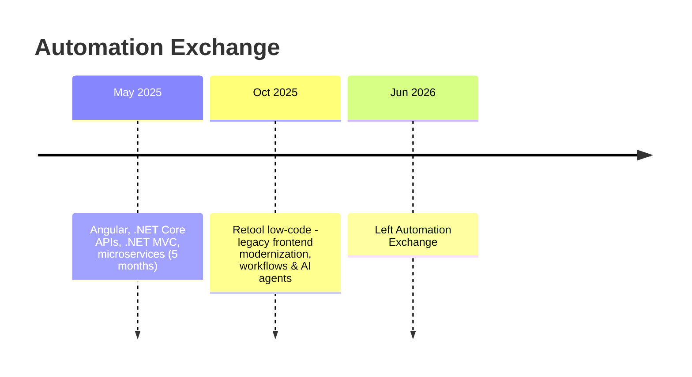
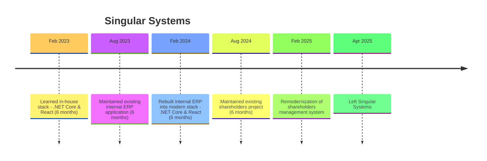

### 👋 Hello!

I'm **Mduduzi**, a full-stack software developer based in Johannesburg, South Africa, with hands-on experience building enterprise and CRM applications using **.NET (ASP.NET Core, Entity Framework Core)**, **Angular**, and **React**. I enjoy solving real business problems end-to-end — from API design and database work through to polished, user-friendly frontends. Outside of work, I'm building **WorkForceNavigator**, a personal HR management system project covering user management, teams, departments, and RBAC, as a space to keep sharpening my craft.

---

### 💼 Experience

<b>Software Developer — Open to Work (June 2026 – Present)</b>

 

- Currently between roles and actively seeking my next opportunity as a Software Developer.
- Designing and building **WorkForceNavigator**, a full-stack HR management system (ASP.NET Core, EF Core, Angular, SQL Server) covering RBAC, teams, departments, and job titles.
- Using this time deliberately to sharpen my skills and prepare for my next role, where I aim to make a real impact from day one.
- Continuously exploring new tools, patterns, and ways of working to become a more efficient and well-rounded developer.

<b>Junior Software Developer — Automation Exchange, Johannesburg (May 2025 – June 2026)</b>

 

- Collaborated with CPOs, Product Owners, developers, testers, training specialists, document specialists, and stakeholders to deliver software solutions.
- Developed and maintained CRM, network management, and enterprise applications using **Angular**, **.NET Core APIs**, **.NET MVC**, and a **microservices architecture**.
- Built and integrated RESTful APIs with internal and external systems.
- Transitioned to **Retool** low-code development — modernizing legacy frontends, building automated workflows, and developing AI agents on the platform that reduced new client onboarding time, streamlined troubleshooting, and saved time for technicians and field service agents.
- Implemented new features, resolved bugs, and enhanced existing applications.
- Performed code reviews, testing, debugging, and troubleshooting.
- Managed CI/CD deployments across development, staging, and pre-production environments.
- Participated in Agile ceremonies including sprint planning, stand-ups, backlog refinement, and retrospectives.

**Breakdown:**

<b>Junior Software Developer — Singular Systems, Johannesburg (February 2023 – April 2025)</b>

 

- Developed and maintained web applications using ASP.NET Core, C#, React TypeScript, and SQL Server.
- Built and maintained RESTful APIs and integrated them with frontend applications.
- Implemented new features, resolved bugs, and enhanced existing systems based on business requirements.
- Wrote LINQ queries and used Entity Framework Core for data access and database operations.
- Performed debugging, testing, code reviews, and troubleshooting to ensure software quality.
- Used Git for version control and collaborated with the development team in an agile environment.

**Breakdown:**

---

### ⚡ Technologies

---

### 🧠 Soft Skills

---

### 🎓 Education & Certifications

- **Advanced Diploma in ICT** (Application Development), NQF 7 — Feb 2020 – Dec 2020
- **Diploma in ICT** (Application Development), NQF 6 — 2017 – 2019
- **Microsoft Certified: Azure Fundamentals (AZ-900)** — April 2026

---

### 📊 GitHub Stats

