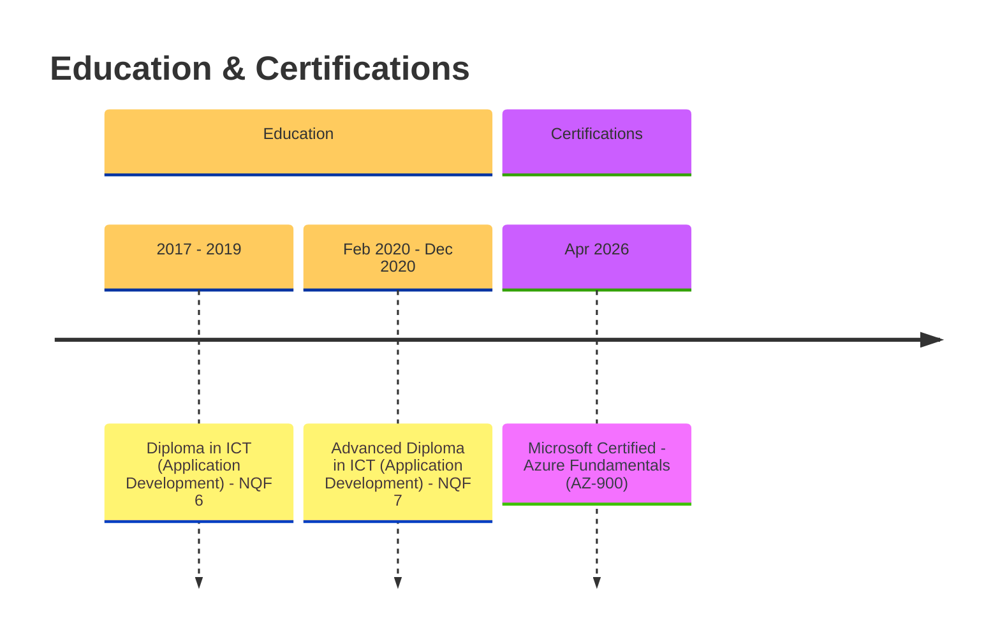
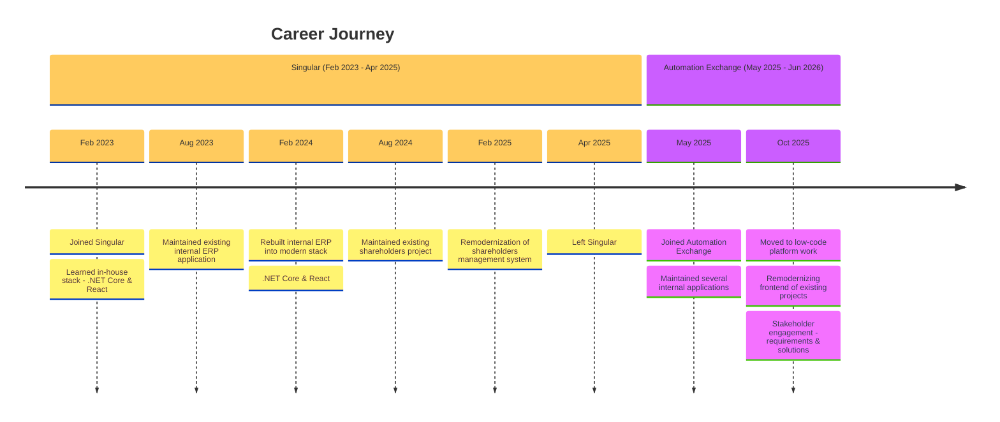

### 👋 Hello!

I'm **Mduduzi**, a full-stack software developer focused on **.NET (ASP.NET Core, Entity Framework Core)** and **Angular**. Currently building **WorkForceNavigator**, an HR management system with user management, teams, departments, and RBAC. I hold a Diploma & Advanced Diploma in ICT (Application Development).

---

### 📞 Contact Me

---

### 🎓 Education & Certifications

---

### 🧭 Career Timeline

---

### ⚡ Technologies

---

### 📊 GitHub Stats

