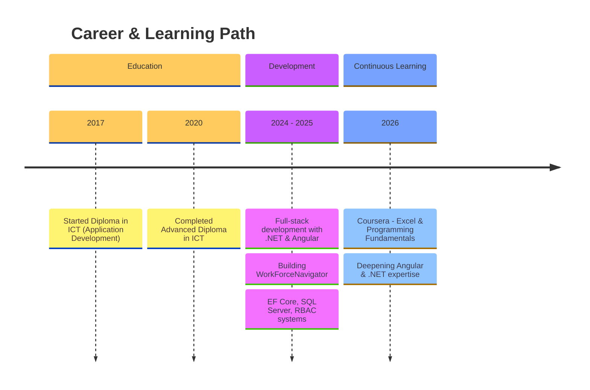

# 

---

## 👋 About Me

Full-stack software developer with a focus on **.NET (ASP.NET Core, Entity Framework Core)** and **Angular**. Currently building **WorkForceNavigator**, an HR management system covering user management, teams, departments, job titles, and RBAC.

- 🎓 Diploma & Advanced Diploma in ICT (Application Development) — Mbombela Campus
- 🔭 Currently working on **WorkForceNavigator**
- 📚 Sharpening fundamentals through Coursera (Excel, programming basics)
- ⚡ Enjoys untangling tricky bugs in reusable Angular components

---

## 🌱 My Journey

---

## 🛠️ Tech Stack

**Backend**  
 

**Frontend**  
   

**Databases**  

**Tools & Platforms**  
     

---

## 📌 GitHub Stats

---

## 💬 Let's Connect

